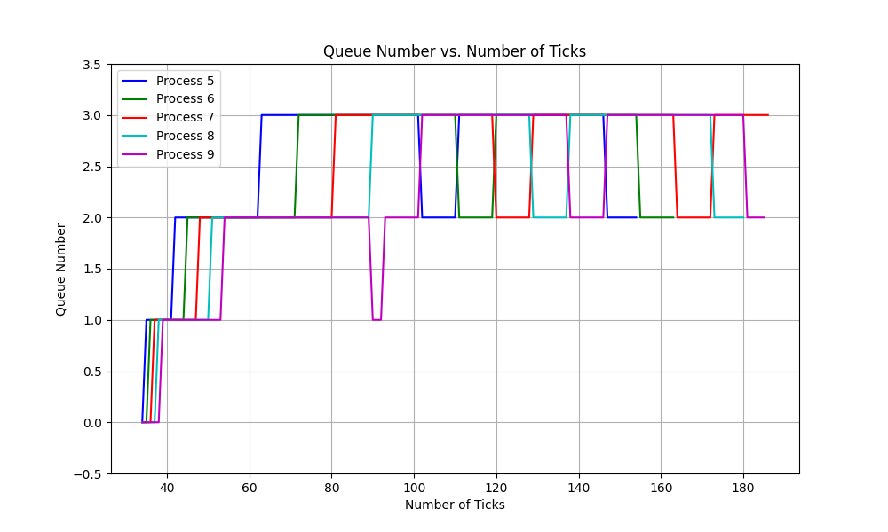

# Testing system calls

## Running Tests for getreadcount

Running tests for this syscall is easy. Just do the following from
inside the `initial-xv6` directory:

```sh
prompt> ./test-getreadcounts.sh
```

If you implemented things correctly, you should get some notification
that the tests passed. If not ...

The tests assume that xv6 source code is found in the `src/` subdirectory.
If it's not there, the script will complain.

The test script does a one-time clean build of your xv6 source code
using a newly generated makefile called `Makefile.test`. You can use
this when debugging (assuming you ever make mistakes, that is), e.g.:

```sh
prompt> cd src/
prompt> make -f Makefile.test qemu-nox
```

You can suppress the repeated building of xv6 in the tests with the
`-s` flag. This should make repeated testing faster:

```sh
prompt> ./test-getreadcounts.sh -s
```

---

## Running Tests for sigalarm and sigreturn

**After implementing both sigalarm and sigreturn**, do the following:
- Make the entry for `alarmtest` in `src/Makefile` inside `UPROGS`
- Run the command inside xv6:
    ```sh
    prompt> alarmtest
    ```

---

## Getting runtimes and waittimes for your schedulers
- Run the following command in xv6:
    ```sh
    prompt> schedulertest
    ```  
---

## Running tests for entire xv6 OS
- Run the following command in xv6:
    ```sh
    prompt> usertests
    ```

---
## Changing Scheduler
To change the scheduler go to Makefile in initial-xv6/src and in Line 52 change the `SCHEDULER` variable to either:
- RR_SCHED
- FCFS_SCHED
- MLFQ_SCHED
or you may also add in command line itself:
`make qemu SCHEDULER=FCFS_SCHED`

## Implementation
### FCFS

**Implementation Details:**

1. **Modification of `struct proc`:**
   - Modified the `struct proc` in `kernel/proc.h` to include an additional field, `ctime`, representing the creation time of the process. This timestamp was used to determine the order in which processes arrived.

   ```c
   struct proc {
     // ...
     int ctime; // Creation time of the process
     // ...
   };
   ```

2. **Scheduler Function:**
   - Implemented the `scheduler()` function in `kernel/proc.c` to choose the scheduling algorithm based on preprocessor directives.
   - Utilized `schedulingChoice` variable to switch between RR and FCFS scheduling.
   - For FCFS scheduling, iterated through the list of processes, selecting the one with the smallest `ctime`.
   - Ensured mutual exclusion using `acquire()` and `release()` to avoid race conditions.

// Rough Pseudocode
   ```c
   void scheduler(void) {
     // ...
     if (schedulingChoice == 1) { // FCFS scheduling
       struct proc *firstProcess = 0;
       for (process = proc; process < &proc[NPROC]; process++) {
         // ...
         if (process->state == RUNNABLE) {
           if (firstProcess == 0 || process->ctime < firstProcess->ctime) {
             // ...
           } else {
             // ...
           }
         } else {
           // ...
         }
       }
       if (firstProcess != 0) {
         // ...
       }
     }
   }
   ```

3. **Disabling Preemption:**
   - Removed calls to `yield()` inside `kerneltrap` and `usertrap` in `kernel/trap.c`. This ensured that processes were not preempted before completing their execution in the FCFS scheduling mode.

   ```c
   // Removed yield() calls inside kerneltrap and usertrap functions
   ```

---
### MLFQ
**Implementation Details:**

1. **Data Structures and Initialization:**
   - Created data structures to manage MLFQ queues and related information:
     - `struct proc *proc_queues[4][NPROC]` to store processes in different queues.
     - `int count_queues[4]` to keep track of the number of processes in each queue.
     - `int time_slice[4]` to define time slices for each queue.
   - Initialized additional fields in `struct proc` during process allocation for MLFQ scheduling.

   ```c
   struct proc {
     // ...
     int current_q;
     int previous_q;
     int time_wait;
     int timeRunning_q;
     // ...
   };
   ```

2. **Queue Manipulation Functions:**
   - Implemented `push_MLFQ()` to add processes to the appropriate queue based on their priority.
   - Implemented `pop_MLFQ()` to remove processes from queues.
   - Ensured mutual exclusion when manipulating queues using `acquire()` and `release()`.

   ```c
   void push_MLFQ(struct proc *p, int queue) {
     // ...
   }

   void pop_MLFQ(struct proc *p, int queue) {
     // ...
   }
   ```

3. **Scheduler Logic:**
   - Developed a scheduler logic that cycles through all processes and handles queue transitions based on process behavior.
   - Monitored the execution time of processes in each queue and adjusted priorities accordingly.
   - Implemented a yield mechanism to allow lower priority processes to execute.

   ```c
   struct proc *p;
   struct cpu *c = mycpu();
   while (1) {
     intr_on();
     for (p = proc; p < &proc[NPROC]; p++) {
       if (p != 0) {
         acquire(&p->lock);
         if (p->state == RUNNABLE) {
           // Adjust process priorities based on MLFQ logic
           // ...
         }
         release(&p->lock);
       }
     }
     // Perform context switches based on MLFQ priorities and time slices
     // ...
   }
   ```

4. **Integration with System Calls:**
   - Modified the `userinit` function to initialize processes with MLFQ scheduling.
   - Integrated MLFQ logic into `fork()` to ensure new processes are added to the appropriate queue.

   ```c
   #ifdef MLFQ_SCHED
   // Integration with userinit and fork functions
   #endif
   ```

---

## Performance Comparisons

| Algorithm | CPU Count | Average Response Time | Average Waiting Time |
|-----------|-----------|-----------------------|----------------------|
| MLFQ      | 1         | 12                    | 124                  |
| FCFS      | 1         | 14                    | 128                  |
| RR        | 1         | 14                    | 155                  |


###  Timeline graphs for processes that are being managed by MLFQ Scheduler


---